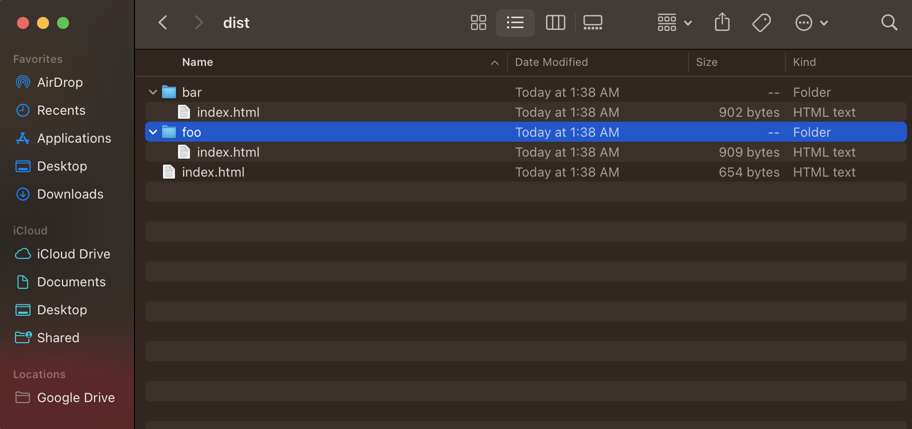

# staticgovanityurls

`staticgovanityurls` (Static Go Vanity URLs) is a simple script that generates
documents to index Go modules on custom domain names.

## Usage

Using the script is dead-simple! All you need is a valid configuration file and 
a copy of the compiled executable. If you have Go installed on the host, you 
can install the script by running:

```bash
$ go install go.nc0.fr/staticgovanityurls@latest
```

Once the binary is installed – and available in $PATH, you will need to write a 
configuration file. 
Here is a sample one:

```yaml
hostname: "go.example.com"
paths: 
    - prefix: "foo" 
      repository: "https://github.com/example/foo.git"
      vcs: "git" 
      dir: "https://github.com/example/foo/tree/master{/dir}"
      file: "https://github.com/example/foo/blob/master{/dir}/{file}#L{line}"
    - prefix: "bar" 
      repository: "https://svn.example.com/~baz/bar.svn"
      vcs: "svn" 
      dir: "https://svn.example.com/~baz/bar.svn{/dir}"
      file: "https://svn.example.com/~baz/bar.svn{/dir}/{file}#{line}"
```

When you are ready, you can generate HTML documents by executing:

```bash
$ staticgovanityurls -i=vanity.yaml -o=dist
```

> The `-i` flag is used to specify the input file, while `-o` is used to
> define the output directory.

Inside the `dist` directory, you should find a set of files as follows:



## Configuration

The configuration file is a YAML document that contains the following fields:

| Field      | Type   | Description                     |
| ---------- | ------ | ------------------------------- |
| `hostname` | string | The hostname of the vanity URL. |
| `paths`    | array  | A list of paths to index.       |

Each path is a map that contains the following fields:

| Field        | Type   | Description                                                                                                                                       |
| ------------ | ------ | ------------------------------------------------------------------------------------------------------------------------------------------------- |
| `prefix`     | string | The prefix of the vanity URL.                                                                                                                     |
| `repository` | string | The URL of the repository.                                                                                                                        |
| `vcs`        | string | The version control system used: `git`, `svn`, `bzr`, `hg` or `fossil`.                                                                           |
| `dir`        | string | URL to a document listing the files inside a directory of the module. It supports substitutions from the `go-source` meta tag.[^go-source]        |
| `file`       | string | URL to a document listing the content – lines – inside a file of the module. It supports substitutions from the `go-source` meta tag[^go-source]. |

[^go-source]: https://github.com/golang/gddo/wiki/Source-Code-Links

## License

The project is governed by a BSD-style license that can be found in the 
[LICENSE](LICENSE) file.

The Gopher illustrations used are under the [CC0](https://github.com/egonelbre/gophers/blob/master/LICENSE-CC0)
license.

